# ESL Games Collection

## Table of contents

- [Overview](#overview)
  - [Links](#links)
  - [Built with](#built-with)
- [Games](#games)
  - [Paper Mario Box Roulette](#paper-mario-box-roulette)
  - [Memory Stomper](#memory-stomper)
  - [Banana Race](#banana-race)
  - [Board Game](#board-game)
  - [Poop Popper](#poop-popper)
  - [Feed The Monster](#feed-the-monster)
  - [Scrambled Image](#scrambled-image)
  - [Bobomb Game](#bobomb-game)
  - [Find The Object](#find-the-object)
  - [Scrambled Words](#scrambled-words)
  - [Go Fishing](#go-fishing)
  - [Hidden Shapes](#hidden-shapes)
  - [Matching Game](#matching-game)
  - [Memory](#memory)
- [Author](#author)
- [Acknowledgments](#acknowledgments)

## Overview

This is a compilation of all the games I created for the smartboard in my ESL classroom in China. These games were originally stand alone games. Each game was created to be used alongside a lesson. Most of them were meant to help students memorize vocabulary. The UI is divided into the Kid's Beginner A book and B book, and then by units 1-16. Each Game pulls from the same global word list. Each unit has a wordlist and phonics wordlist that corresponds to the books. Students who had the Android app could touch the words and hear it read to them. This was a much easier way to practice the words at home than using the CD that the books came with. This way students could practice without their parent's help. The Chinese education system is heavily centered around memorizing large volumes of information and then repeating it back. This app streamlined this process inside and outside the classroom. To use the app simply choose a unit and then press the menu button at the top left corner. You will see a list of the games for that unit, as well as the option to choose between different word lists. You can choose phonics words, vocabulary words, or both. On the top right hand corner you can globally turn off the background music for all games. You can restart the current game with the restart button. Opening this menu will always pause the current game.

|                                          |                                            |
| :--------------------------------------: | :----------------------------------------: |
| 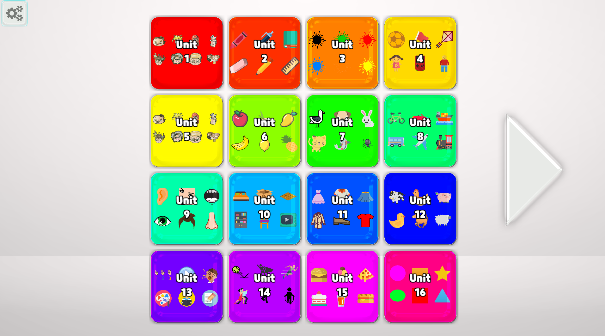 | 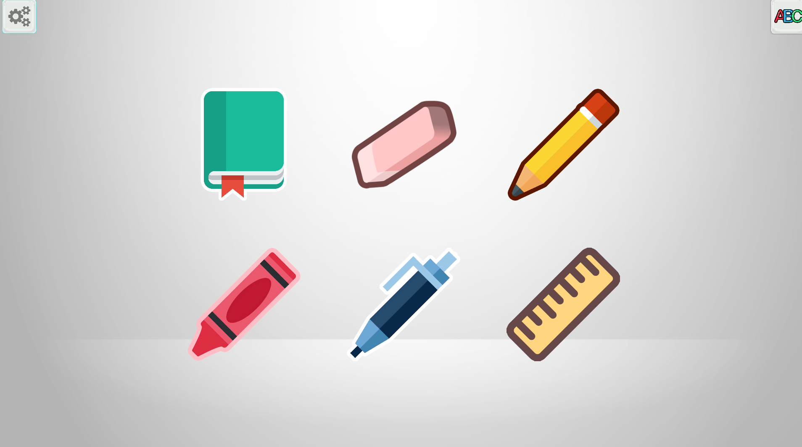 |

|                                           |                                             |
| :---------------------------------------: | :-----------------------------------------: |
| 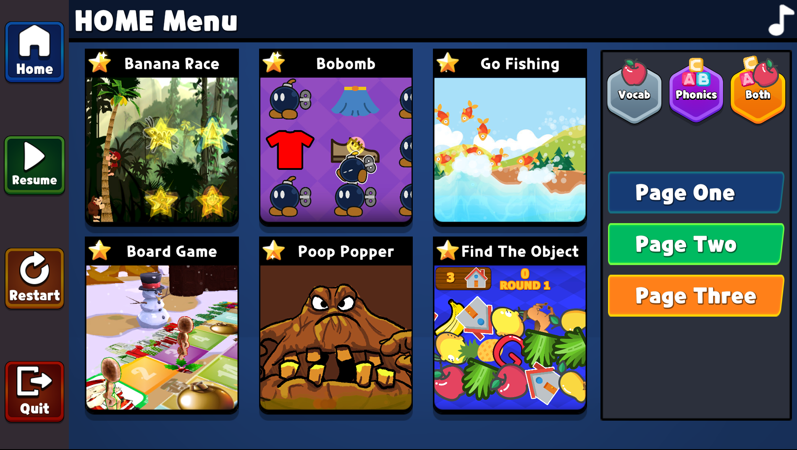 | 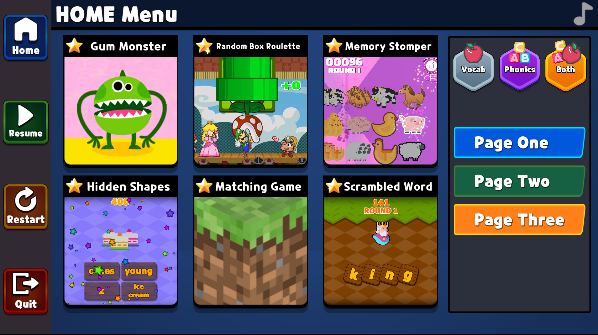 |

### Links

- GitHub URL: [https://github.com/seanred360/ESL-Game-Collection]
- Live Site URL: [https://seanred.itch.io/esl-games-collection]

### Built with

- [Unity](https://unity.com/) - Game engine

## Games

### Paper Mario Box Roulette

|                                                           |                                                            |
| :-------------------------------------------------------: | :--------------------------------------------------------: |
| 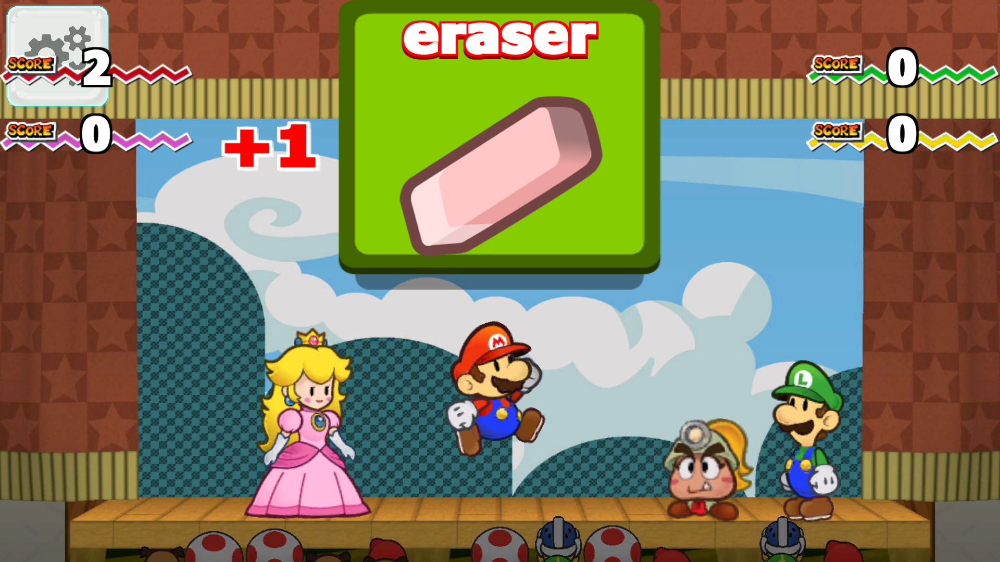 | 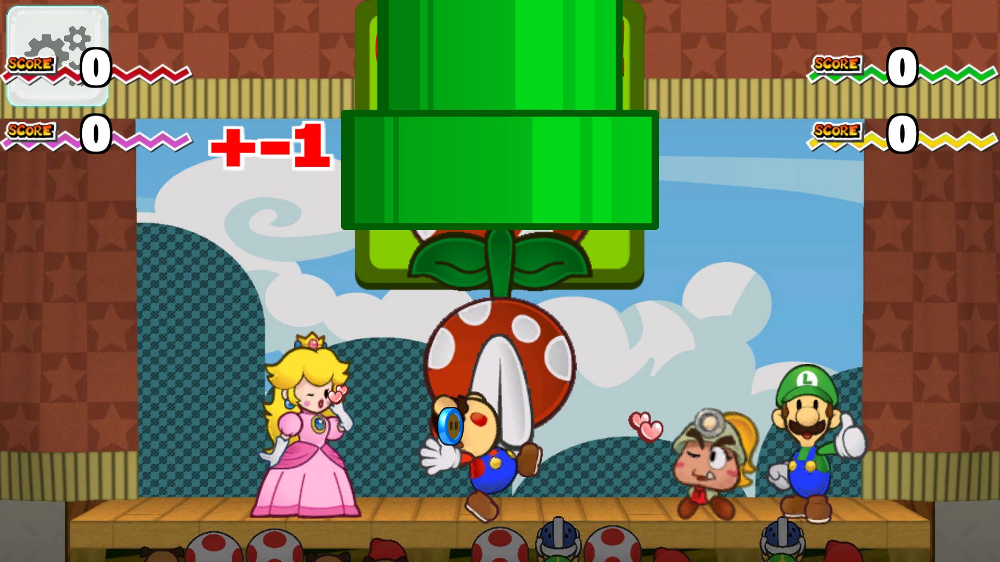 |

#### How to play

This game was designed to help students remember vocabulary words. The Paper Mario Character sprites were ripped from the original game, and I rigged them with Unity's built in 2d skeleton system. This game is similar to Russian Roulette. The class is divided into 2-4 teams, each team is represented by a Mario character. Team 1 plays first by clicking the mystery block. A random word or question will popup and the student must say the word or answer the question. Their team will get 1 coin. The student can continue to click the mystery box until they find a Piranha Plant. If they get a Piranha Plant, they lose all their coins and their turn is over. The more times the mystery box is clicked, the higher the chances of getting a Piranha Plant. The strategy is to press the button many times and then end your turn so that the next team has a higher chance of getting a Piranha Plant. As the round continues the tension builds until one team gets a Piranha Plant and ALL their coins spill out onto the stage. If the team had a lot of coins, it is very dramatic seeing them all spill out.

### Memory Stomper

|                                                       |                                               |
| :---------------------------------------------------: | :-------------------------------------------: |
| 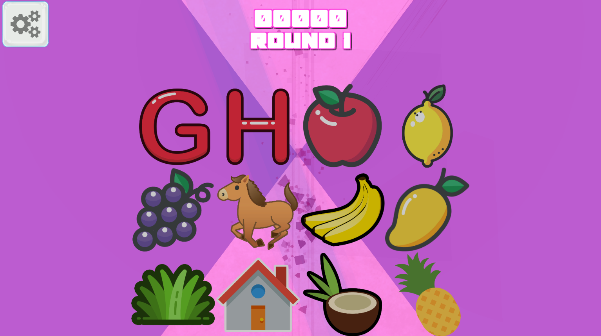 | 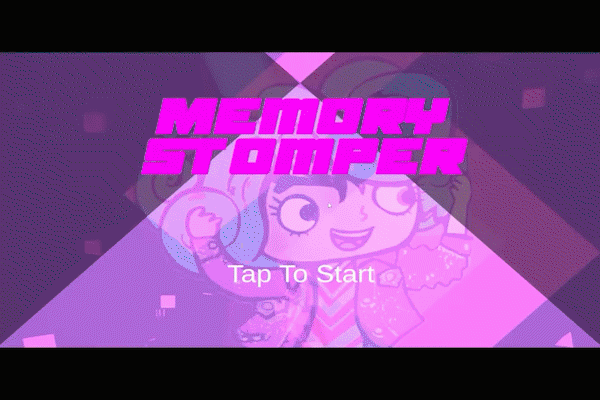 |

#### How to play

The visual style of this game was inspired by [Rocky Hong's](https://www.rockyhong.com/) Beat Stomper. Each round several vocabulary words are called out. Students must click the correct picture in the same order they were called out. If successful, a new round begins and the same words are called out again, but one more word is added. The game continues in rounds until the student makes a mistake. The game gets very intense in the classroom when one of the students gets a very high score. The students like to cheer on their classmate. This game lets the better students show off to their classesmates, and get recognition for their hard work. It also repeats the words hundreds of times to the class while keeping them engaged, which helps with memorization and listening skills.

### Banana Race

|                                                    |                                            |
| :------------------------------------------------: | :----------------------------------------: |
| 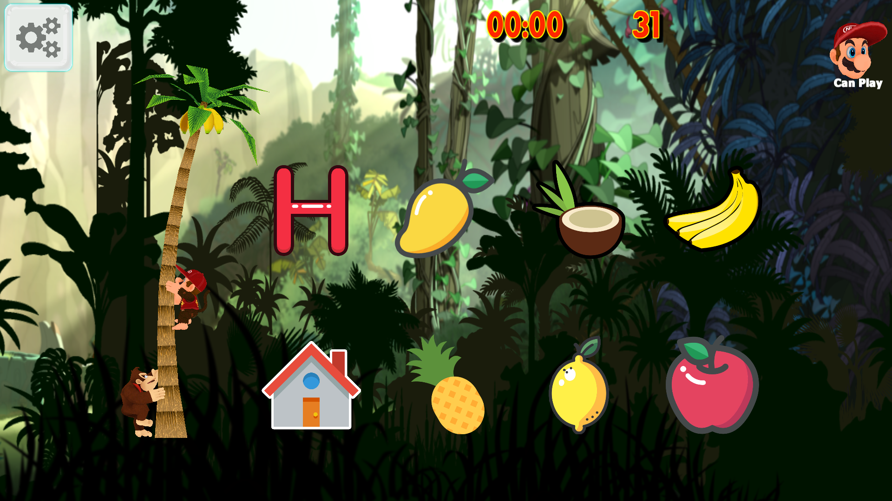 |  |

#### How to play

Divide the class into 2 teams. Team 1 lines up at the board and students take turns touching the vocabulary word that is called out. If a student gets the answer correct, their team's monkey climbs up the tree. If they make a mistake, their monkey climbs down the tree. When team 1 gets their monkey to the top of the tree the round is over. Next Team 2 takes their turn. The team that has the lowest time is the winner.

### Board Game

|                                                   |                                                    |
| :-----------------------------------------------: | :------------------------------------------------: |
| 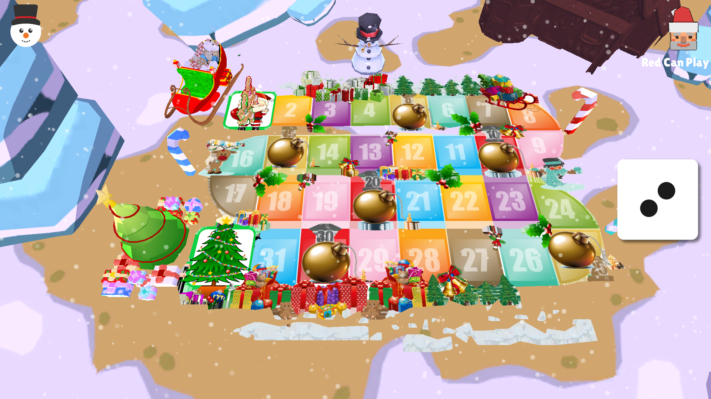 | 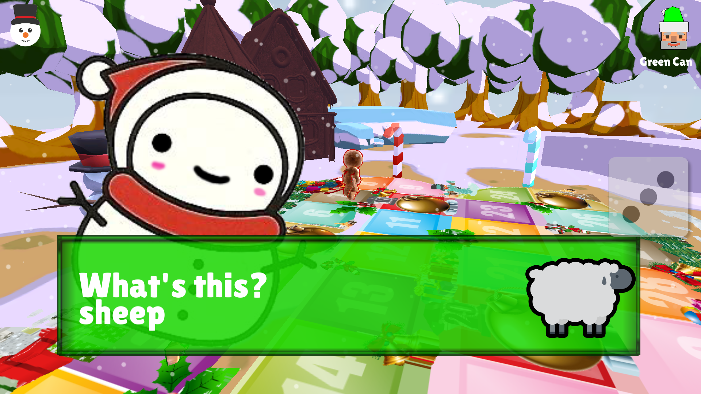 |

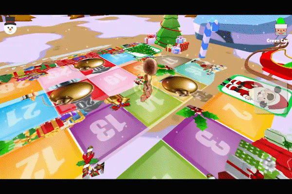

#### How to play

Originally created as a review game at Christmas time for middle school classes of 50 students. Divide the class into red team and green team. Teams take turns rolling the dice. When a student rolls a dice their team's gingerbread man moves to the correct space. When a question prompt pops up the student must choose a classmate to ask the question to, or do what the prompt says together. This was more interesting in a class of 50 students because students liked calling out their friends in front of the whole class. If the gingerbread man landed on a bomb, it would explode and then move back a random number of steps. The team that got to the Christmas tree at the end first won the game.

### Poop Popper

|                                                  |                                                   |
| :----------------------------------------------: | :-----------------------------------------------: |
| 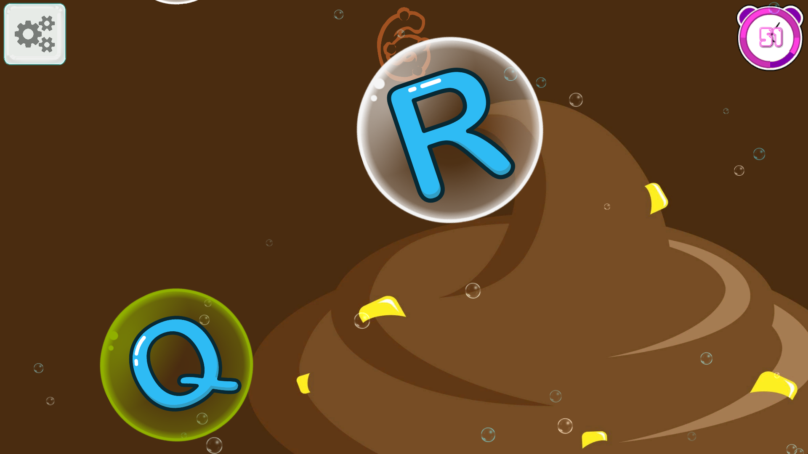 | 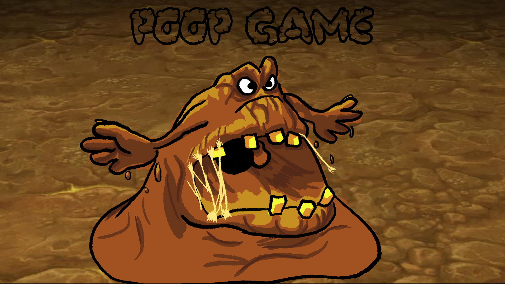 |

#### How to play

The Poop character is from the classic N64 game Conker's Bad Fur Day. I recreated the boss intro animation in 2d. Students must line up at the board. When the poop monster sings, they must pass the hitting stick to the student behind them. Students must pop as many bubbles as they can and say the vocabulary word. If they pop a poop bubble they lose points. The game and the music gradually get faster and the game gets more difficult.

### Feed The Monster

|                                                    |                                                     |
| :------------------------------------------------: | :-------------------------------------------------: |
| 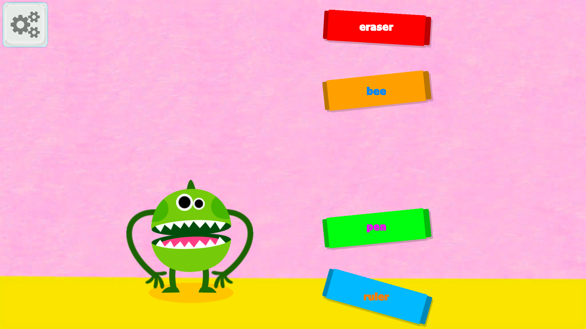 | 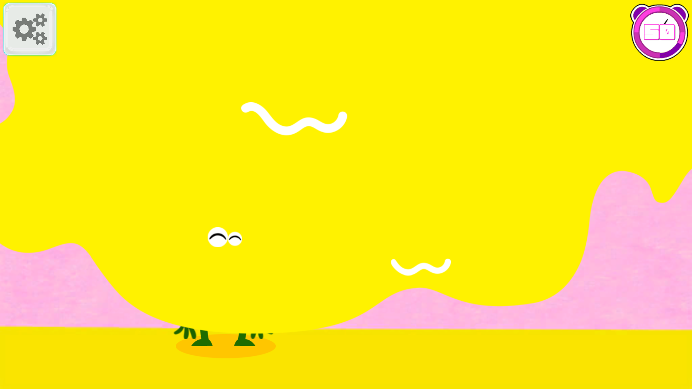 |

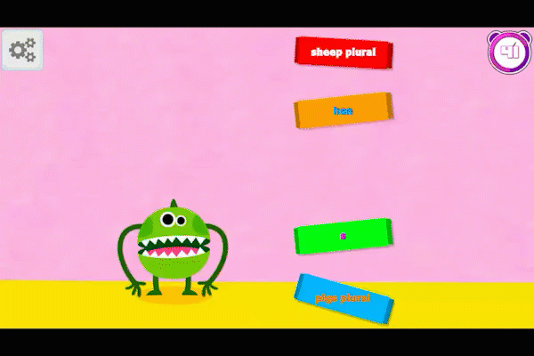

#### How to play

This game was a recreation of a game that Pink Fong made for phones. I directly ripped the art assets from that game and coded the logic to fit my needs. I created this game to teach students that the writing in their books have a meaning, and letters in their book correspond to the spoken words they had already learned. Students listen for a word to be called out, then drag the gum that has the correct word on it over to the monster. If the word is correct, the monster will eat it, otherwise it will refuse and shake it's head NO. If students did not know how to read a word they could look at their books. Memorizing words is familiar to students because Chinese writing can only be memorized, Chinese hanzi does not have a way to sound out words. Students that were too young to learn phonics could be introduced to reading this way. Older students could try and sound out words and read them.

### Bobomb Game

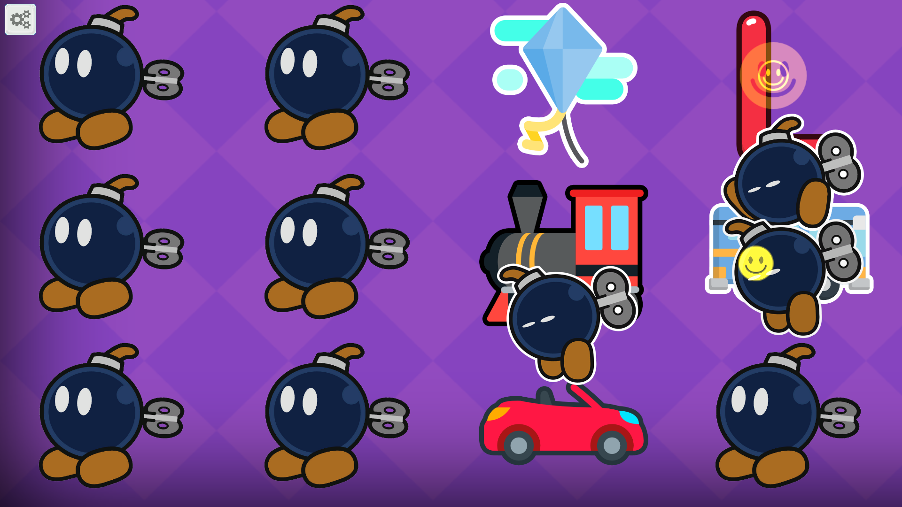

#### How to play

Inspired by a game I played with friends while eating dinner. Students take turns choosing bombs and saying to vocabulary word under the bomb. Eventually one student chooses the exploding bomb and must do some sort of penalty. Younger children pretended to die. Older students had to do tasks such as read from their book, sing, dance, eat gross tasting candy etc.

### Scrambled Image

|                                                        |                                                         |
| :----------------------------------------------------: | :-----------------------------------------------------: |
| 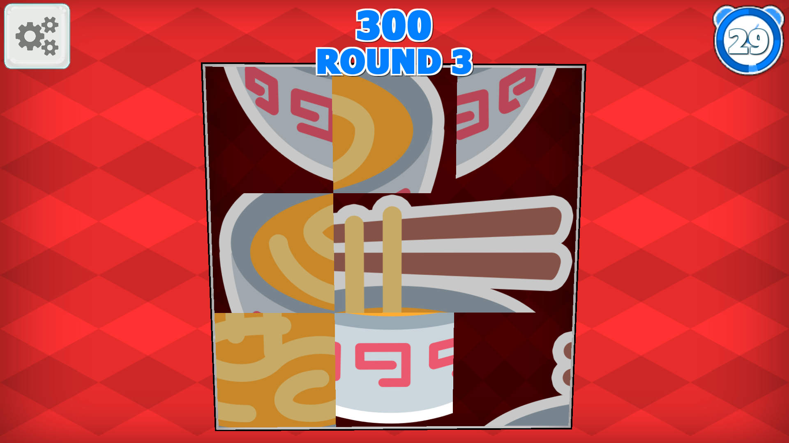 | 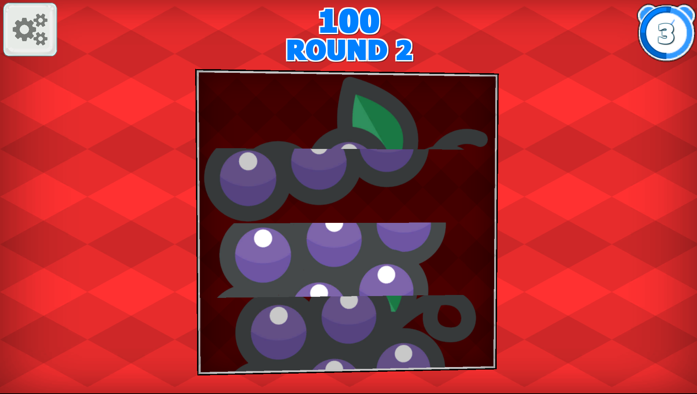 |

#### How to play

The students must unscramble the image by sliding around the pieces. The game has 2 modes, the image can be in a vertical stacked mode, or a box shape. The students must unscramble the image before the timer runs out. Each round the number of tiles increase and the game gets harder.

### Find The Object

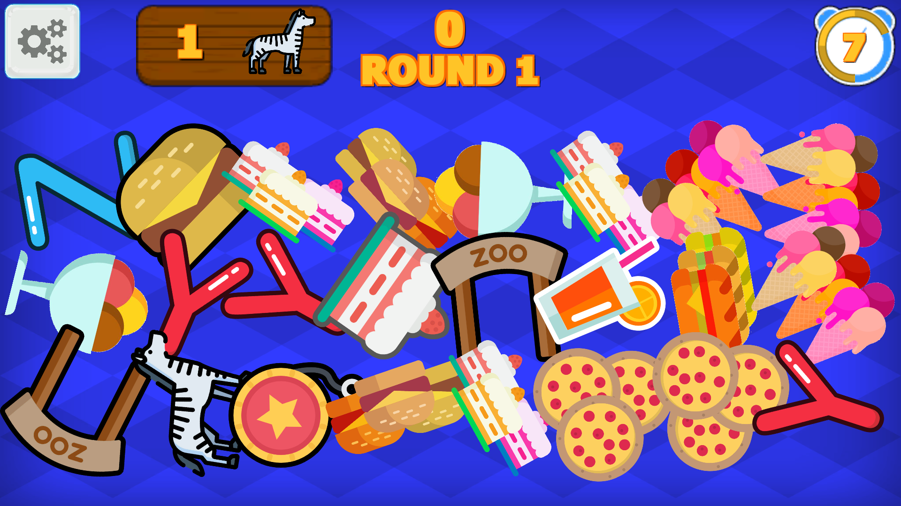

#### How to play

Students work together to try and get the highest score possible. The game can be played with images or words. In each round students have 10 seconds to find a randomly generated amount of objects. If they are successful, the difficulty increases and there are more objects to sort through. The game continues in rounds until the students fail to find the objects in under 10 seconds. You can play the game in casual mode without a timer by clicking on the clock. I created this mode for younger students who got stressed out too easily and would give up quickly. After the game is over, students can see which classes have the highest score. This was a great motivator for more competitive students. In China, there is steep competition between students to get the best test scores because there are hard caps on how many students are allowed to go to high school and university. This kind of game helped students see their classmates as teammates rather than opponents.

### Scrambled Words

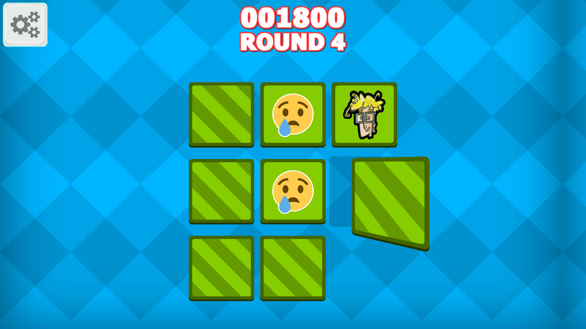

#### How to play

Students are shown a scrambled word that they must unscramble by swapping tiles. There is a hint button students can push if they find it too difficult. Students at the middle school found this very exciting because they could show off their spelling skills to their classmates. Typically I divided the class into 2 teams that competed for a higher score.

### Go Fishing

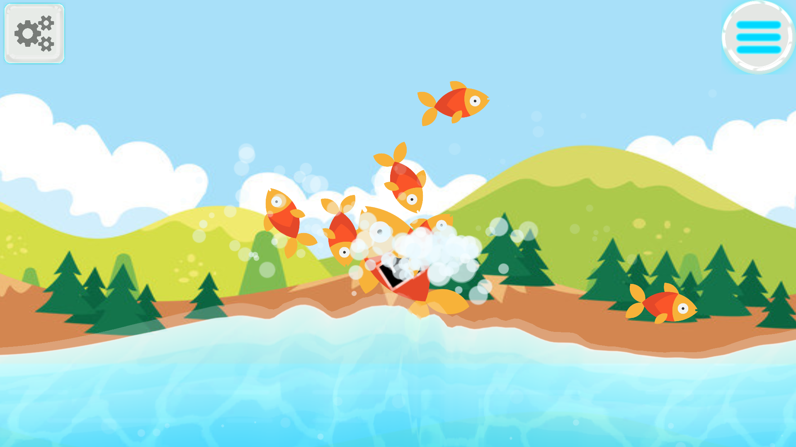

#### How to play

I think of this game as a toy rather than a game. I noticed that the younger students did not have the motor skills to play my other games but they really enjoyed hitting the smartboard. I gave the students a pillow that looked like a wooden stick, and let them try to hit one of the fish. When they were successful, the fish showed a number, which could correspond to something in their book that they had to do, or some other activity that I had for that lesson.

### Hidden Shapes

|                                                       |                                                       |
| :---------------------------------------------------: | :---------------------------------------------------: |
| 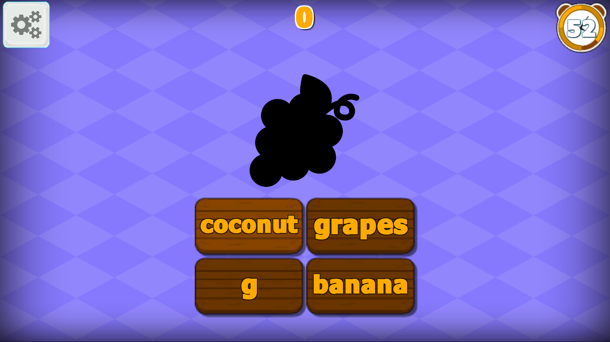 | 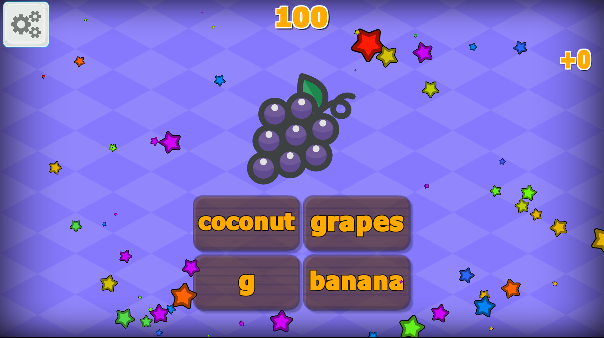 |

#### How to play

Another game to help students practice reading. A silhouette for a random vocabulary word is shown, and 4 randomly generated words are shown. A student will try to choose the correct word to match the silhouette. If the student chooses correctly the vocabulary word image is revealed. There is a casual mode without a timer, and a normal mode with a timer.

### Matching Game

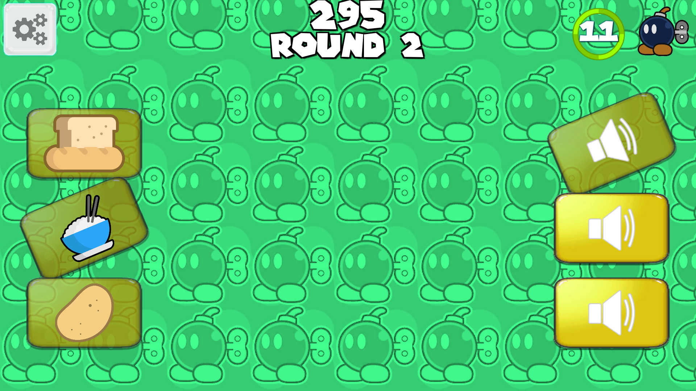

#### How to play

Students must match to sound with the vocabulary word. They have to find all the matches before the timer runs out.

### Memory

#### How to play

A classic game of memory. Students complete rounds by finding all the matches. The game starts out with only 1 pair of cards. Each round more matches are added and the timer is reset. The game continues until students cannot find all the matches in the time limit. This game encouraged students to work together and organize each other. They had to line up in an orderly way and help each other find the matches quickly. If a student was slower the other teammates would help them. As with most of my games, the students can see which classes have the highest score.

## Author

- Website - [seanred.io](https://seanred.io)
- GitHub - [seanred360](https://github.com/seanred360)

## Acknowledgments

- [Brackeys](https://www.youtube.com/c/Brackeys/videos)
- [Jason Weimann](https://www.youtube.com/c/Unity3dCollege/videos)
- Mei Han
- Ivy International English
- Puppeteer
